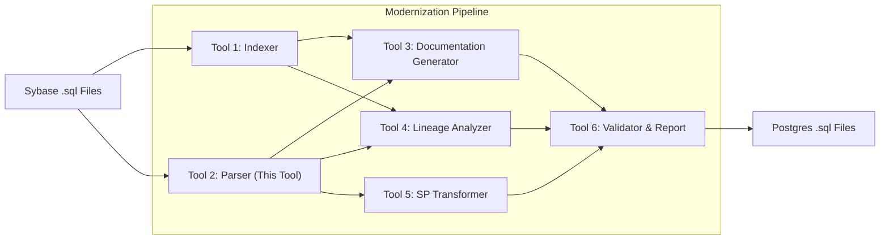

---

---

# 🧭 Sybase Stored Procedure Parser — AST Generator


---

## 📌 Overview

This project parses Sybase stored procedures, triggers, and functions and produces a structured Abstract Syntax Tree (AST) in JSON format. The AST is intended for downstream tools such as documentation generators, lineage analyzers, and stored-procedure transformers used during Sybase → PostgreSQL modernization.

Key goals:
- Produce a stable, enterprise-grade AST schema
- Extract parameters, variables, cursors, control flow and DML/DDL statements
- Provide an ANTLR-based parsing pipeline (with Python runtime)

---

## ✅ Features

- Parse Sybase stored procedures, triggers, and functions into JSON ASTs
- Extract input/output parameters, declared variables, and types
- Handle control flow (IF/ELSE, WHILE, CASE, TRY/CATCH, BEGIN/END)
- Support cursor lifecycle (DECLARE / OPEN / FETCH / CLOSE / DEALLOCATE)
- Capture DML and (some) DDL statements, temp tables and dynamic SQL (EXECUTE)
- Built on ANTLR grammar with a listener that converts parse trees to AST JSON

---

## 📂 Repository layout

Top-level files and directories in this workspace:

```
grammar/               # ANTLR grammar files and generated parser code
fixedSchema/           # JSON schema(s) and mapping files
input/                 # Folder to place .sql input files
output/                # Folder where generated AST (.json) files are written
ast_listener.py        # AST builder: converts ANTLR parse tree → AST JSON
parser.py              # CLI entry point for parsing .sql → .json
validator.py           # (optional) validates ASTs against schema
requirements.txt       # Python dependencies
README.md              # Project documentation (this file)
```

Inside `grammar/` you'll find the ANTLR `.g4` sources (TSqlLexer.g4, TSqlParser.g4) and the generated Python parser/listener files.

---

## 📦 Installation

Requirements:
- Python 3.8+
- Java (for running ANTLR tool if you need to regenerate generated sources)

Install Python deps:

```powershell
pip install -r requirements.txt
```

If you need to regenerate parser sources, download ANTLR (https://www.antlr.org/) and run the jar. Example (PowerShell):

```powershell
# download or place antlr jar in tools\ directory
java -jar path\to\antlr-4.13.1-complete.jar -Dlanguage=Python3 TSqlLexer.g4 TSqlParser.g4 -visitor -listener -o grammar/generated
```

Notes:
- On macOS you can `brew install antlr`, but on Windows download the jar from the ANTLR site.
- The project includes generated parser files under `grammar/` so you may not need to run ANTLR unless you change the grammar.

---

## ▶️ Usage

Basic parser usage (PowerShell):

```powershell
python parser.py --input input\temp_input.sql --output output\ast.json
```

Options:
- `--input`  Path to a `.sql` file containing Sybase stored procedure(s)
- `--output` Path to save AST JSON

Notes about input/output folders:
- By convention this project uses an `input/` folder for source `.sql` files and an `output/` folder for generated AST JSON files.
- Example workflow:

```powershell
# place your .sql files in the input folder
ls input\*.sql

# run parser and write AST(s) to the output folder
python parser.py --input input\my_procedure.sql --output output\my_procedure_ast.json
```


Example input (sample .sql):

```sql
CREATE PROCEDURE sp_insert_order
  @order_id INT,
  @cust_id INT
AS
BEGIN
  INSERT INTO orders VALUES (@order_id, @cust_id);
END
```

Example output (sample ast.json):

```json
{
  "procedure": "sp_insert_order",
  "params": [
    {"name": "@order_id", "type": "INT"},
    {"name": "@cust_id", "type": "INT"}
  ],
  "variables": [],
  "cursors": [],
  "statements": [
    {"type": "INSERT", "table": "orders", "values": ["@order_id","@cust_id"]}
  ]
}
```

---

## 🛠️ Developer / Setup Notes

- The parser is implemented using ANTLR-generated parser/lexer and an AST listener (`ast_listener.py`) which walks the parse tree and builds JSON.
- If you modify grammar files (`grammar/*.g4`), regenerate the Python sources then run tests / sample parsing to validate.
- Use `validator.py` to check AST against `fixedSchema/fixedschema.json` if available.

Regenerating the parser (example):

```powershell
java -jar antlr-4.13.1-complete.jar -Dlanguage=Python3 TSqlLexer.g4 TSqlParser.g4 -visitor -listener
```

### ⚙️ Optional: `run_all.py` — quick parse + validate

There is a small convenience runner, `run_all.py`, which performs a simple two-step validation flow:

1. Run the local `parser.py` to produce an AST (JSON).
2. Run `validator.py` to validate the produced AST against the fixed schema at `fixedSchema/fixedschema.json`.

This procedure is completely optional — it's only used to validate the parser output, not to transform or modify source files. The validation schema file (`fixedSchema/fixedschema.json`) can be changed to suit your project's requirements. The runner simply invokes the parser and then the validator and reports failures; it does not alter the AST or inputs.

Basic usage (PowerShell):

```powershell
python run_all.py
```

The `run_all.py` script can be edited if you want different default paths (for example using `output_data/ast.json` or a different schema). Use it as a lightweight validation step in your dev workflow.

---

## 🔧 Troubleshooting

- "ANTLR not found" — ensure Java is installed and you have the ANTLR jar available.
- "Empty AST" — confirm you passed `--input` and the SQL file contains valid Sybase procedure syntax.
- Encoding issues — save `.sql` files in UTF-8.

---

## 🔗 Integration and Workflow

This parser is intended to be part of a modernization pipeline:



---

## 🤝 Contributing

1. Fork the repo
2. Create a new branch (`feature/my-feature`)
3. Commit your changes (`git commit -m 'Add my feature'`)
4. Push to the branch (`git push origin feature/my-feature`)
5. Open a Pull Request


---

## 🛡️ License

MIT — see the `LICENSE` file if present.


## 🚀 Extending & Customizing Tool 2

* Add new statement types in **grammar/.g4** files
* Update **ast\_listener.py** to handle new AST node types
* Extend schema and listener to support **triggers** and **functions**, and advanced DDL
* Integrate with **Tool 3–6** for modernization pipeline

---
